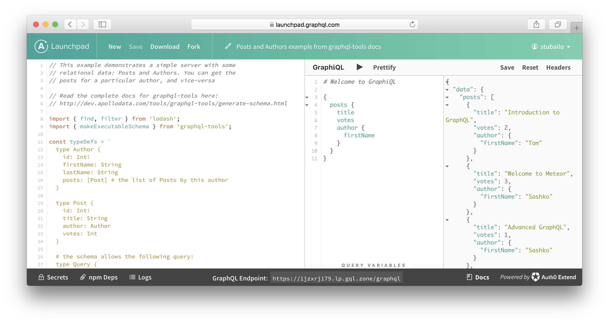

# Launchpad

Launchpad is an in-browser GraphQL server playground. You can write a GraphQL
schema example in JavaScript, and instantly create a serverless,
publicly-accessible GraphQL endpoint. We call these code snippets that live on
Launchpad “pads”.

Read the [announcement post](https://dev-blog.apollodata.com/introducing-launchpad-the-graphql-server-demo-platform-cc4e7481fcba) to understand the goals of the project.

Read the [documentation](docs.md) to learn the ins and outs of Launchpad!

## List of pads

This is a list of great pads deployed at Launchpad.

- [Hello World!](https://launchpad.graphql.com/new) - a super simple schema with one field, that just returns `"Hello, world!"`
- [Relational data: Authors and posts](https://launchpad.graphql.com/1jzxrj179) - a more complex schema that has related objects that can be fetched in a nested query.
- [Simple Mocking with graphql-tools](https://launchpad.graphql.com/98lq7vz8r) - a simple example of using the default mocking in graphql-tools to create realistic mocked data in seconds.
- [Loading from a MongoDB database](https://launchpad.graphql.com/vkmr1kl83) - an example of reading from a remote data source, in this case MongoDB.
- [Social Login with Auth0](https://launchpad.graphql.com/n4xk8xm87) - Authentication via JWT and social login
- [Star Wars API](https://launchpad.graphql.com/mpjk0plp9) - the Star Wars API you know and love from GraphQL.org.
- [graphql-relay-tools](https://launchpad.graphql.com/1w4r8lx49) - Relay-compliant Star Wars API created using a package that makes it easy to create a relay-compliant schema together with `graphql-tools`.
- [graphql-iso-date](https://launchpad.graphql.com/vkvpvznr3) - example code for a package that makes encoding dates in different ways easy.
- [Full-stack GraphQL + React tutorial server](https://launchpad.graphql.com/rwrz11zrn) - the result of step 2 of the excellent [Full-stack GraphQL + React tutorial](https://dev-blog.apollodata.com/full-stack-react-graphql-tutorial-582ac8d24e3b)
- [GraphQL.js code sample with mutation](https://launchpad.graphql.com/98lpqv3rr) - the basic code sample of a mutation from [this page on GraphQL.org](http://graphql.org/graphql-js/mutations-and-input-types/)
- [Movie Recommendations with Neo4j](https://launchpad.graphql.com/3wzp7qnjv) - a simple movie schema with recommendations, backed by Neo4j graph database
- [Current Weather at any location](https://launchpad.graphql.com/5rrx10z19) - Get the current weather at any location through Google Maps API geocoding and the Dark Sky weather API!
- [One To Many And One To One Relationships](https://launchpad.graphql.com/4nqqqmr19) - example showing how to implement one to many and one to one relationships the easy way
- [Spotify API with Expo Snack UI](https://launchpad.graphql.com/pjwnq05l0) - how to fetch from the Spotify REST API with GraphQL, and then display it in a [React Native UI](https://snack.expo.io/ry2l_IXZW).
- [RSVP management for events](https://launchpad.graphql.com/4nq37v3x9) - Shows multiple query mutations per Mutation type, as well as querying deeply nested data.

Something is missing?
[Create an issue!](https://github.com/apollographql/launchpad/issues/new)

Help Launchpad by creating more pads! Examples of the pads are available
[in issues under corresponding label](https://github.com/apollographql/launchpad/issues?q=is%3Aopen+is%3Aissue+label%3A%22launchpad+example%22)

[](https://launchpad.graphql.com/1jzxrj179)

## Development

### Running the frontend code

There are two ways to run Launchpad - against the staging server or against
your own server. Running against staging server is simpler, but naturally
you can't control the server. Note that running against staging server is
only possible on localhost and is meant for development purposes.

Both server and the client locally use `.env` file to set up settings. You
just need one `.env` file in the root of the project with all of the variables
which are read by the client and/or server.

For running against staging server, the config should be like following (you
can also copy `.env.staging.template` to your `.env`):

```
REACT_APP_LAUNCHPAD_API_URL=https://wt-launchpad.it.auth0.com/api/run/launchpad-staging/launchpad
REACT_APP_AUTH0_DOMAIN=meteor.auth0.com
REACT_APP_AUTH0_CLIENT_ID=kUtxJjyapGN72Rs7tt5jXMgQ7axDgJLa
```

Then local server can be run:

```
npm install # npm 5 recommended
npm start
```

To test:

```
npm install
npm run check
```

Limitation - currently logs are not accessible on staging (or by running single
tenant server yourself).

### Running the server

Running the server is more complicated. You need MongoDB, Auth0 account and
Auth0 Extend account (currently it requires enterprise account). Once you get
those, you can set the server and client up with the following `.env` file.

```
REACT_APP_LAUNCHPAD_API_URL=localhost:8080
REACT_APP_AUTH0_DOMAIN={YOUR AUTH0 DOMAIN}
REACT_APP_AUTH0_CLIENT_ID={YOUR AUTH0 CLIENTID}
WT_TOKEN={YOUR MASTER AUTH0 EXTEND TOKEN}
WT_API={YOUR AUTH0 EXTEND OR WEBTAKS API URL}
WT_SINGLE_TENANT_CONTAINER={Container name if running single tenant webtask/extend}
WT_NO_PROXY=true
MONGODB_URL={YOUR MONGODB URL}
AUTH0_SECRET={YOUR AUTH0 SECRET}
```

Then you can run server

```
npm install
npm run start-server
```

### Production

Building frontend production bundle:

```
npm run build
```

Build backend into a webtask.

```
npm run build-server
```

## Contributing

See [CONTRIBUTING.md](CONTRIBUTING.md).
